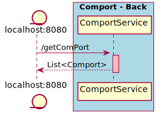

# SpringBootDemo

Caracteristicas:
- Integracion con ComPort---Front
- Capas controller, service, serviceImpl
- Borrador de funciones openPort y closePort

Mejoras Posibles:
- Finalizar las funciones  openPort y closePort
- Agregado de funcion getInputStream
- Fix de error. An internal error occurred during: "Ready state poller". java.lang.NullPointerException
- Fix de nombres en secuencia

## Diagramas
Secuencia:

